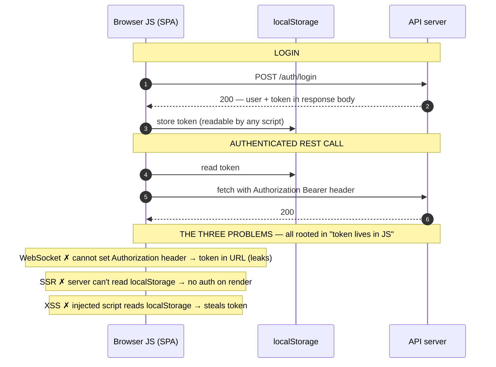
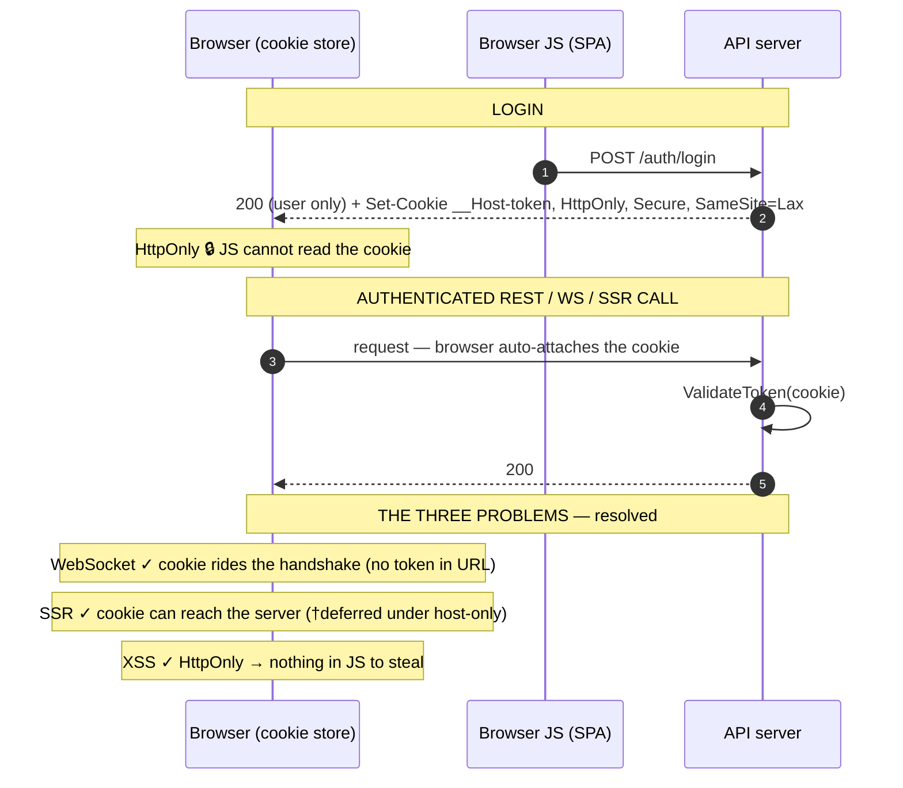
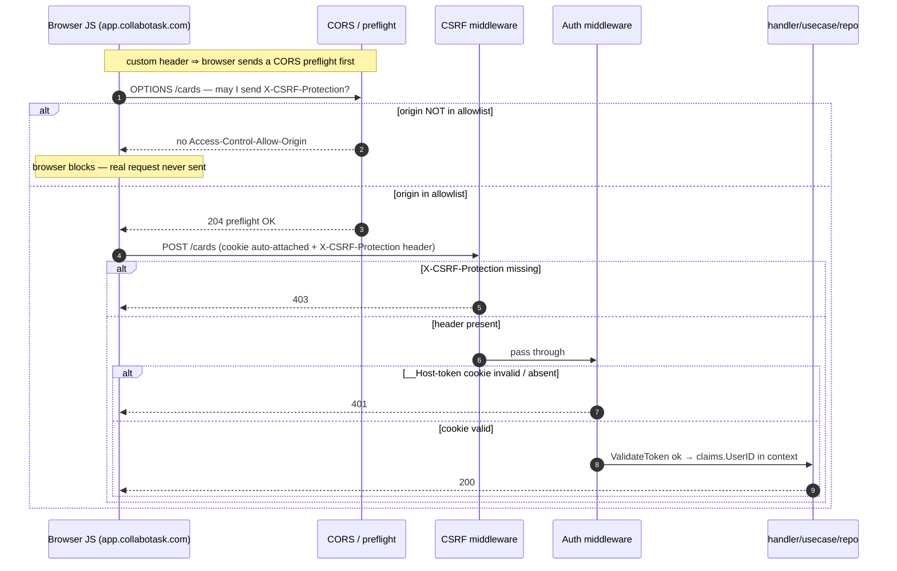
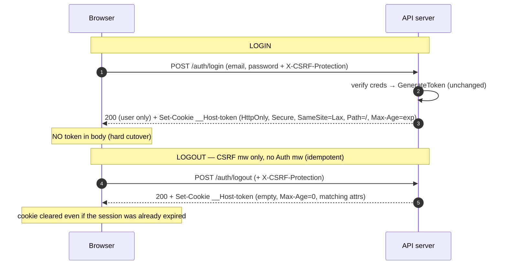

# ADR-008: Authentication — JWT delivery via httpOnly cookie (`Bearer` → cookie), hard cutover

- **Status:** Accepted
- **Date:** 2026-07-23
- **Scope:** How the Phase-1 JWT reaches the server across REST **and** the coming WebSocket **and** SSR — moving from `Authorization: Bearer` (a JS-held token) to an **httpOnly, Secure, SameSite cookie**. New build step **③.5**, sequenced **before** step ④ (WebSocket, [ADR-009](./adr-009-websocket-realtime-layer.md)). Covers eight decisions: **token-storage model** (JWT-in-cookie vs session table), **client/API topology** (sibling-subdomain vs single-origin), **cookie `Domain` scope** (host-only vs shared) and its coupling to authenticated SSR, **cookie attributes** (incl. `SameSite=Lax` vs `Strict`), **CSRF** strategy, **migration ergonomics** (hard cutover vs dual-read), **logout**, and the **CORS** correction. Supersedes the reservation stub this file previously held. Build guidance: `docs/handoff/handoff-auth-httponly-cookie.md`.

## Context

Grilling the WebSocket layer (ADR-009) surfaced that "how does the JWT reach the WS handshake" is a symptom of a deeper question: **where the token lives on the client.** The current `Bearer`-in-JS model has three problems for the target stack (Astro SSG public zone + Vite SPA app zone — with realtime over WebSocket):

1. **WebSocket:** a browser's native `WebSocket` cannot set an `Authorization` header → forces a `?token=` query param or a `Sec-WebSocket-Protocol` hack (token in the URL, logged everywhere).
2. **SSR:** `localStorage`/JS memory is invisible to the Next.js **server**, so it cannot make authenticated calls during server render.
3. **XSS:** a JS-readable token is exfiltratable — the #1 practical token-theft vector.

An **httpOnly cookie** solves all three at once: it rides the WS handshake and every REST/SSR request automatically, and JS cannot read it. The product owner chose to **do this properly and first**, as a fundamental prerequisite of the realtime layer, rather than smuggle a token into the WebSocket.

Two constraints shape the decisions below. **(a) The frontend is not built yet** — there is *no live browser client* depending on `Bearer`; the only current `Bearer` consumers are Swagger, Postman/curl, and manual dev testing. So this is not a migration guarding existing clients; it is a chance to *establish* the auth model from scratch. **(b) Phase-1 scope discipline** — refresh tokens, account deletion, and public boards are already deferred to Phase 2 (CLAUDE.md); this step must not silently pull them forward.

Current state: [`middleware.Auth`](../../../collabotask-backend/internal/delivery/http/middleware/auth.go) reads `Authorization: Bearer`; [`infraauth.ValidateToken`](../../../collabotask-backend/internal/infrastructure/auth/jwt.go) validates it; login/register return the token in the response body ([`auth_handler.go`](../../../collabotask-backend/internal/delivery/http/handler/auth_handler.go)); CORS defaults to `["*"]` with `AllowCredentials: true` ([`config.go`](../../../collabotask-backend/internal/config/config.go), [`cors.go`](../../../collabotask-backend/internal/delivery/http/middleware/cors.go)) — a combination browsers reject outright.

## Options Considered

### 1. Token-storage model — JWT-in-cookie vs session-id table

- **JWT in the cookie (chosen).** The cookie carries the existing signed JWT; the server stays **stateless**. Smallest change — the token moves from the response body into `Set-Cookie`, and the middleware reads it from the cookie instead of the header. `GenerateToken`/`ValidateToken` are untouched.
- **Session-id backed by a table (rejected for Phase 1 → Phase 2).** An opaque id in the cookie pointing at a `sessions` row; a DB lookup per request. This is the **architecturally better fit** for a realtime collaboration app — it enables true logout, revocation ("log out all devices"), and is the natural anchor for presence and refresh-token rotation. But it is stateful infrastructure (table, migration, repo, expiry sweep) whose one benefit — revocation — the Phase-1 spec does not require, and whose stateless-JWT alternative already exists and works. The realtime layer's *continuous access enforcement* (ADR-009) is an **authorization** concern re-checked live against the DB, so it does not depend on this choice. **Deferred to Phase 2**, most likely as a short-lived access token + revocable refresh/session (the hybrid), where refresh tokens already live.

**Honest note:** the stateless JWT's one advantage (no DB lookup to authenticate) is the *least* valuable property for a membership-driven, revocation-sensitive, realtime app — which is why the session model is the right end-state. It is deferred on *scope* grounds, not because it is the weaker design.

### 2. Client/API topology — sibling-subdomain (A) vs cross-site (B) vs single-origin (C2)

This is the hinge: it decides whether `SameSite` protects for free, how hard CSRF is, and the CORS surface. "Site" = registrable domain (`collabotask.com`); "origin" = scheme+host+port.

- **(A) Sibling subdomains (chosen):** `app.collabotask.com` ↔ `api.collabotask.com` — **same-site, cross-origin.** `SameSite=Lax` cookies *are* sent app→api (same-site) but *not* from `evil.com` (cross-site) — browser-level CSRF for free on the common case. Still cross-*origin*, so CORS with `AllowCredentials` + an explicit allowlist is required. Standard "separate SPA + API" shape; clean WS handshake. Works in dev (`localhost:3000`→`localhost:8080` is same-site; browsers exempt `localhost` from `Secure`).
- **(B) Cross-site (rejected):** frontend and API on **different registrable domains** → `SameSite=Lax` won't send the cookie at all → forced to `SameSite=None; Secure`, which re-opens CSRF and makes the app-level token the only guard. The most fragile option.
- **(C2) Single origin via reverse proxy (deferred → future enhancement):** one public origin (`collabotask.com`), a proxy/LB path-routes `/api`→Go, `/ws`→Go, `/`→Next.js. **Most secure** — browser sees one origin, **no CORS at all**, `SameSite=Strict` viable, airtight WS origin check, API not directly reachable — *and* it gives authenticated SSR with a tight first-party cookie. Its cost is operational: a reverse proxy standardized across **every** environment incl. dev. (The in-process Next.js-BFF variant, "C1", was rejected outright: it puts Node in the API data path — extra hop, tier coupling, and awkward WS proxying.) **C2 is the promotion path from A** when the drivers in §Consequences appear.

### 3. Cookie `Domain` scope — host-only vs shared — and the SSR-auth coupling

Under topology A this is a real fork with a security-surface cost, and it *is* the "do we want authenticated SSR" question.

- **Host-only (chosen):** no `Domain=` attribute → the cookie belongs to `api.` only. Client-side `fetch` app→api still works (same-site, `credentials:'include'`); the WS handshake to `api.` still carries it. **Only** authenticated SSR breaks — the Vite SPA (on `app.`) has no server, so it cannot render authenticated pages server-side regardless. Blast radius = one host; a subdomain takeover elsewhere never sees the cookie.
- **Shared `Domain=collabotask.com` (rejected for now):** the cookie is sent to *every* `*.collabotask.com` host → the Next.js server receives it → **authenticated SSR works** — but every current/future subdomain (and any subdomain takeover) is now in the cookie's blast radius. `HttpOnly` does **not** help here: it stops JS *reading* the cookie, not a malicious subdomain *server* *receiving* it.

Authenticated SSR was a stated *motivation* for this migration; it still holds, but under A you only get it by accepting the shared-`Domain` surface. Chosen host-only because the gated zone is a **live realtime board** — it hydrates and opens a socket immediately, so server-rendering it with the user's data buys little; the public zone is unauthenticated anyway. When SSR auth genuinely pays off, the answer is **C2** (which gives SSR auth *and* a tight cookie), not shared-`Domain` (which widens the surface).

### 4. Cookie attributes — incl. `SameSite=Lax` vs `Strict`

Chosen cookie: `__Host-token=<jwt>; HttpOnly; Secure; SameSite=Lax; Path=/; Max-Age=<cfg.JWTExpiration>`.

- **`HttpOnly`** — the whole point; non-negotiable. **`Secure`** — always on; browsers treat `http://localhost` as a secure context so dev works. A `COOKIE_SECURE` flag (default `true`) covers oddball non-`localhost` http dev; when off, the `__Host-` prefix is dropped and a plain configured cookie name is used (the prefix *requires* `Secure`). **`Path=/`**. **`__Host-` prefix** — a free hardening win *because* we chose host-only: the browser refuses the cookie unless it is `Secure`, `Path=/`, and has **no `Domain`**, locking the host-only decision in at the browser level.
- **`SameSite=Lax` (chosen) vs `Strict` (rejected).** `Strict` is normally impossible for SPA+API (drops the cookie on top-level cross-site navigation *into* the app — the "email link → logged-out" flash), and here that reason doesn't even apply since the cookie is on a pure-API host nobody navigates to top-level. But `Strict` *buys* almost nothing over `Lax`: `Lax` already refuses the cookie on cross-site `POST`/`PATCH`/`DELETE` (all mutations), and a well-designed API has no state-changing GETs (the only thing `Lax` additionally permits). Meanwhile `Strict` *plants a foot-gun*: any future **top-level link pointed at the API domain** (email verification, file download, OAuth callback) would silently break. So `Lax` — equal protection for mutations, no latent breakage.
- **Lifetime:** persistent, `Max-Age` driven from the *same* `cfg.JWTExpiration` value (single source of truth — cookie and token die together). *(Reconcile: SRS §3.5 states 7-day expiry; code default is 24h. The design is expiration-agnostic — it tracks whatever `cfg.JWTExpiration` is.)*

### 5. CSRF

The moment the cookie auto-attaches, CSRF risk is inherited. `SameSite=Lax` + the cross-origin API (topology A) already close the cross-*site* case and force a preflight on `PUT/PATCH/DELETE`. The **residual gap** is a **same-site sibling subdomain** (e.g. a subdomain takeover): `SameSite` treats it as friendly, and a plain-content-type `POST` is a "simple" request that skips preflight — and CORS does **not** block a simple request from *executing* (it only blocks *reading the response*), so the side effect lands.

- **Minimal — `SameSite=Lax` + CORS only (rejected):** leaves the sibling-subdomain `POST` hole open; safety rests on an operational promise of perfect subdomain hygiene forever.
- **Required custom header (chosen):** middleware rejects any state-changing request lacking `X-CSRF-Protection`. A custom header forces a **CORS preflight** on *any* cross-origin request; the preflight is gated by the origin allowlist, which the attacker's subdomain isn't on → blocked. Omit the header → 403. Both branches dead-end. No token lifecycle: security comes from "only CORS-authorized JS can set a custom header," so a static value suffices (OWASP "custom request header" defense, valid because the API is consumed only by the SPA's `fetch`).
- **Double-submit token (rejected):** a readable token cookie echoed in a header — more moving parts (generation, rotation, comparison) for no gain over the custom header on a fetch-only JSON API.

Applied **uniformly** to all state-changing methods **including** `login`/`register`/`logout` — this also blocks **login-CSRF** (an unauthenticated but state-changing attack that plants the attacker's session in the victim's browser). Login is already largely covered by JSON-only + CORS preflight; the uniform rule makes it explicit and exception-free.

### 6. Migration ergonomics — hard cutover vs dual-read

- **Hard cutover, cookie-only (chosen):** middleware reads the **cookie only**; login/register `Set-Cookie` and **drop `token` from the response body**. Because the frontend isn't built, there is no client to keep working — and this achieves the migration's XSS goal *by construction*: **no token is ever handed to browser JS**, so a future dev *cannot* stash it in `localStorage`. Single auth path, no escape hatch. Cost: modestly more manual tooling (Swagger security scheme for the CSRF header; cookie jar in curl/Postman/tests) — a dev-only inconvenience.
- **Dual-read, cookie + `Bearer` (rejected):** keeps tooling frictionless and would serve future non-browser clients, but re-exposes the token to JS at login (tempting the exact insecure pattern this migration kills) and maintains a permanent second auth path that can silently undo the httpOnly benefit. If a genuine non-browser client appears in Phase 2, add a *purpose-built* API-token path then, rather than carrying a general escape hatch now.

### 7. Logout

`Bearer` needed no logout (the client dropped the token); a browser-held cookie does. Since the model is stateless, logout = **clear the cookie**.

- **Unconditional `POST /auth/logout` (chosen):** state-changing (so CSRF-protected), lives in the public `auth` group, **does not run the `Auth` middleware** → clears idempotently even for an expired session (avoiding the "expired cookie can't log out" edge). Re-issues `__Host-token` empty with `Max-Age=0` and matching attributes; returns `200`.
- **Auth-gated logout (rejected):** requiring a valid session to log out only creates the expired-cookie edge case for no benefit.

**Limitation (inherent to the stateless choice #1):** logout removes the browser's copy but cannot *invalidate* an already-issued JWT server-side. Under httpOnly hard cutover that is a *complete* logout for the realistic threat model (no other copy exists to replay). True "kill this token now" / "log out all devices" arrives with the Phase-2 session model.

### 8. CORS — correction (mostly forced, not a free choice)

The current config cannot work with a credentialed cookie and has latent bugs the cookie would expose:

- `CORS_ALLOWED_ORIGINS = ["*"]` + `AllowCredentials: true` is **rejected by browsers** (a credentialed request cannot be answered with `ACAO: *`). → explicit allowlist, reflect the matched origin.
- `AllowedMethods` lacks **`PATCH`** (the API uses it for update/role) → cross-origin `PATCH` would be denied. → add `PATCH`.
- `cors.go` falls back to `AllowedOrigins[0]` for non-matching origins (reflects a *wrong* origin) → must emit **no `ACAO`** for disallowed origins.
- `AllowedHeaders: ["*"]` is unreliable with credentials → **enumerate** `Content-Type, X-CSRF-Protection`.
- Add **`Vary: Origin`** when reflecting; **fail-fast at config load** if `AllowCredentials && origins contains "*"`.

## Decision

1. **Cookie carries the JWT; stateless** (Option 1-JWT). Session/refresh model → Phase 2.
2. **Topology A** — cross-origin sibling subdomains (`app.` ↔ `api.`). **C2 single-origin → future enhancement.**
3. **Host-only cookie** (no `Domain=`); **no authenticated SSR** in Phase 1. C2 is the promotion path when SSR auth is wanted.
4. **Cookie:** `__Host-token=<jwt>; HttpOnly; Secure; SameSite=Lax; Path=/; Max-Age=<cfg.JWTExpiration>`; `COOKIE_SECURE`/`COOKIE_NAME` config for local/CI (drop `Secure` + `__Host-` prefix when insecure).
5. **CSRF = required `X-CSRF-Protection` header** on all state-changing requests (incl. `login`/`register`/`logout`), enforced by a new middleware, backed by strict CORS + `SameSite=Lax`.
6. **Hard cutover** — cookie-only; middleware reads the cookie; login/register drop the body token; no `Bearer`.
7. **Logout** — unconditional, CSRF-protected `POST /api/v1/auth/logout` that clears the cookie; `200`; not behind `Auth`.
8. **CORS corrected** — explicit allowlist, reflect-if-allowlisted, `AllowCredentials: true`, methods `GET,POST,PATCH,DELETE,OPTIONS`, headers `Content-Type,X-CSRF-Protection`, `Vary: Origin`, fail-fast on `*`+credentials.
- **Riders:** register **keeps auto-login** (sets the cookie); the CSRF header applies **uniformly**.

### Out of scope (deferred, recorded so they aren't lost)

- **Session/refresh-token model + true server-side revocation** ("log out all devices") → Phase 2. The architecturally-preferred fit, deferred on scope; likely a short access token + revocable refresh/session.
- **C2 single-origin (reverse proxy)** → future enhancement; gains authenticated SSR **and** deletes the CORS surface in one move. Promote when the SSR-auth drivers appear (below).
- **Email verification** → Phase 2 or later; when it lands it **supersedes register-auto-login** (register stops issuing a session before the email is confirmed).
- **Authenticated SSR under topology A** (shared-`Domain`) → explicitly *not* the chosen path to SSR auth; reach for C2 instead.

## How it works (mechanism)

### Before → After (the shift in one picture)

**BEFORE — `Bearer`, JS-held token.** The token lives in JavaScript; the app must attach it by hand on every call. That single fact causes all three problems.

**AFTER — httpOnly cookie, hard cutover.** The token lives in a cookie the browser attaches automatically and JS cannot read. No storing, no header-wrangling.

**(†) SSR caveat for *our* chosen config:** the httpOnly cookie makes SSR auth *possible in general*, but our **host-only + topology-A** decisions (§2, §3) deliberately **defer authenticated SSR** — a `api.`-scoped cookie is not sent to any server on `app.`, and the Vite SPA has no server anyway. SSR auth is unlocked later by **C2 single-origin** (or, less preferably, a shared-`Domain` cookie). The WebSocket and XSS wins apply **now**; the SSR win is the understood-but-deferred one.

### Request flow — authenticated mutation

### Login / logout

### Why the CSRF header is sufficient without a secret
A cross-origin page (incl. a sibling-subdomain takeover) faces a fork with no exit: **include** `X-CSRF-Protection` → the custom header forces a preflight → the CORS allowlist (only `app.`) rejects it; **omit** it → the middleware 403s. Only same-origin / CORS-authorized JS can attach a custom header in the victim's browser, so a static value is enough — the check is "could only our SPA have set this," not "is this secret correct."

## Consequences

**Positive**
- Closes the three problems that motivated the migration: WS handshake authenticates from the cookie (no `?token=`), the token is no longer JS-readable (XSS-hardened *by construction* via hard cutover), and the door to SSR auth is understood (via C2 when wanted).
- Reuses all JWT infrastructure — `GenerateToken`/`ValidateToken`/claims/expiry unchanged; the change is transport + delivery, low-risk.
- CSRF is closed against both cross-site and the sibling-subdomain vector `SameSite` alone leaves open, at ~one middleware's cost and no token lifecycle.
- Corrects real latent CORS bugs (`*`+credentials, missing `PATCH`, wrong-origin fallback) before they ship.
- Unblocks ADR-009 with a clean, shared origin allowlist for REST + WS.

**Negative / notes**
- **No server-side token revocation** (stateless) — logout clears the browser copy only; accepted, closed by the Phase-2 session model.
- **No authenticated SSR** under host-only + topology A — accepted; promote to C2 when it pays off. **SSR-auth drivers to watch:** frequent cold authenticated loads (shared-link opens, users without a pinned tab), Core-Web-Vitals pressure on the logged-in app, a mobile/slow-network user base.
- **More manual tooling** — Swagger needs a CSRF header security scheme; curl/Postman/tests need a cookie jar + the header. Dev-only.
- **Sibling-subdomain hygiene still matters** for defense-in-depth even though CSRF is closed (host-only keeps the auth cookie off other subdomains; a shared-`Domain` cookie must never be introduced casually).
- **Register auto-login is provisional** — the day email verification lands, it is removed.
